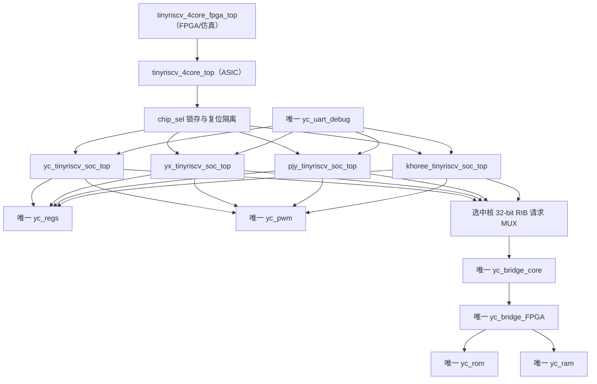

# 四核资源合并说明

更新日期：2026-08-03

## 1. 实际集成架构

ASIC 交付到 `tinyriscv_4core_top` 为止，因此图中 `yc_bridge_FPGA/yc_rom/yc_ram` 位于
`fpga/`，不会进入流片 filelist。端到端仿真和 FPGA 上板用
`tinyriscv_4core_fpga_top`，所以测试与上板访问的是同一套共享 YC 存储链路。

## 2. 四核怎样接入共享资源

- `regs`：四个核的两读一写端口提升到顶层，由 `chip_sel` 选择后连接唯一
  `yc_regs u_shared_regs`；`x26/x27` 也从该实例读出。
- PWM：四个 SoC 的 PWM 从设备请求提升到顶层，地址归一后连接唯一
  `yc_pwm u_shared_pwm`。私有 PWM 没有实例化，也不在最终 RTL 中。
- UART debug：唯一 `yc_uart_debug u_shared_uart_debug` 产生主设备请求，请求只送入
  被选中的 core。
- 存储：四个核只输出统一的 32-bit `req/we/addr/wdata` 并接收
  `rdata/ack/hold`。顶层选择请求后连接唯一 `yc_bridge_core`。YX/PJY/Khoree 原私有
  chip bridge 已从有效 RTL 删除。
- 普通 UART 和 I2C：各核内部逻辑保留，顶层只复用选中核的物理输出；I2C 以开漏方式
  合并。

未选中核持续复位。非法 `chip_sel` 会禁止寄存器、PWM、debug 和存储写请求并给出安全输出。

## 3. 删除与保留

只对 PJY 按课程要求进行功能删减：删除乘除/余数数据通路、CSR、CLINT、中断/异常、
JTAG、Timer、SPI、GPIO。Khoree 新版本自身不含这些有效逻辑。四核私有
`regs/pwm/uart_debug` 均不进入最终层次。

为真正共享存储链路，本轮进一步从有效 RTL 移除了：

- `yx .../perips/bridge.v`；
- `pjy .../perips/mem_bridge_chip.v`；
- `khoree .../perips/mem_bridge_chip.v`。

只保留 YC `bridge_core.v`。ROM、RAM、FPGA-side bridge 全部放在 `fpga/rtl/`，只用于
FPGA 和端到端仿真，不属于流片逻辑。

## 4. 实例数量审计

最终有效层次要求并已检查：

| 实例 | ASIC 顶层 | FPGA 顶层 |
|---|---:|---:|
| YC regs | 1 | 继承 ASIC 的 1 |
| YC PWM | 1 | 继承 ASIC 的 1 |
| YC uart_debug | 1 | 继承 ASIC 的 1 |
| YC bridge_core | 1 | 继承 ASIC 的 1 |
| YC bridge_FPGA | 0 | 1 |
| YC ROM | 0 | 1 |
| YC RAM | 0 | 1 |

`sim/filelist.f` 共 59 个 Verilog 文件、60 个有效模块；`rtl/` 没有未使用 Verilog。
`tools/audit_resources.ps1` 同时检查共享实例数量、私有桥残留及禁止层次。
