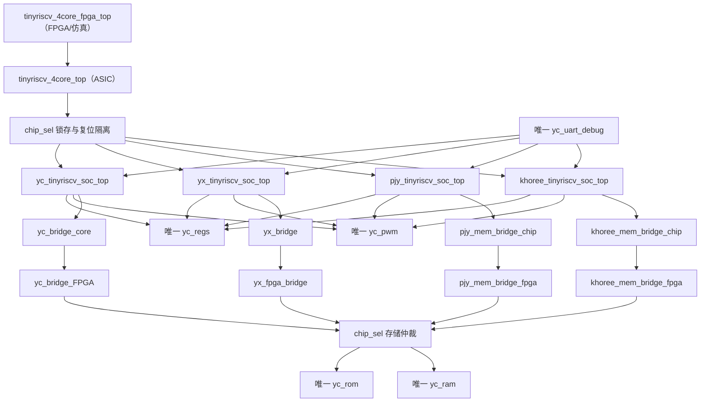

# 四核资源合并说明

更新日期：2026-08-03

## 1. 实际集成架构

ASIC 交付到 `tinyriscv_4core_top` 为止。四个 chip-side bridge 属于芯片接口逻辑；
四个 FPGA-side bridge 以及 `yc_rom/yc_ram` 位于 `fpga/`，不会进入流片 filelist。
端到端仿真和 FPGA 上板都使用 `tinyriscv_4core_fpga_top`。

## 2. 四核怎样接入共享资源

- `regs`：四个核的两读一写端口提升到顶层，由 `chip_sel` 选择后连接唯一
  `yc_regs u_shared_regs`；`x26/x27` 也从该实例读出。
- PWM：四个 SoC 的 PWM 从设备请求提升到顶层，地址归一后连接唯一
  `yc_pwm u_shared_pwm`。私有 PWM 没有实例化，也不在最终 RTL 中。
- UART debug：唯一 `yc_uart_debug u_shared_uart_debug` 产生主设备请求，请求只送入
  被选中的 core。
- 存储：每个 core 保留自己的 chip-side bridge，以维持其原始握手与字节传输协议。
  顶层只把当前 `chip_sel` 对应 bridge 的 8-bit 外部接口送到 PAD。FPGA/仿真顶层用四个
  匹配的 FPGA-side bridge 解码，再把所选请求仲裁到一份 YC ROM/RAM。
- 普通 UART 和 I2C：各核内部逻辑保留，顶层只复用选中核的物理输出；I2C 以开漏方式
  合并。

未选中核持续复位。非法 `chip_sel` 会禁止寄存器、PWM、debug 和存储写请求并给出安全输出。

## 3. 删除与保留

只对 PJY 按课程要求进行功能删减：删除乘除/余数数据通路、CSR、CLINT、中断/异常、
JTAG、Timer、SPI、GPIO。Khoree 新版本自身不含这些有效逻辑。四核私有
`regs/pwm/uart_debug` 均不进入最终层次。

没有删除各 core 的有效 chip-side bridge；当前保留 `yc_bridge_core`、`yx_bridge`、
`pjy_mem_bridge_chip`、`khoree_mem_bridge_chip`。ROM、RAM 和 FPGA-side bridge 全部放在
`fpga/rtl/`，只用于 FPGA 和端到端仿真，不属于流片逻辑。

## 4. 实例数量审计

最终有效层次要求并已检查：

| 实例 | ASIC 顶层 | FPGA 顶层 |
|---|---:|---:|
| YC regs | 1 | 继承 ASIC 的 1 |
| YC PWM | 1 | 继承 ASIC 的 1 |
| YC uart_debug | 1 | 继承 ASIC 的 1 |
| YC/YX/PJY/Khoree chip bridge | 各 1 | 继承 ASIC 的各 1 |
| YC/YX/PJY/Khoree FPGA bridge | 0 | 各 1 |
| YC ROM | 0 | 1 |
| YC RAM | 0 | 1 |

`tools/audit_resources.ps1` 检查三项共享资源、四个私有 bridge、禁止层次以及
ROM/RAM/FPGA bridge 与流片 filelist 的隔离。

## 5. PAD 包装顶层

`tinyriscv_4core_top_IO` 保留 GitHub 基线中与后端 `io.file` 对应的 PAD 实例名。逻辑顶层
继续使用 `000/001/010/011 = YC/YX/PJY/Khoree`；包装层把旧低有效物理选择编码
`111/110/101/011` 转换成上述逻辑编码，其他编码转为非法选择。I²C 的开漏控制由逻辑顶层
显式输出 `i2c_scl_drive_low_o/i2c_sda_drive_low_o`，供双向 PAD 的 `OEN` 使用。
